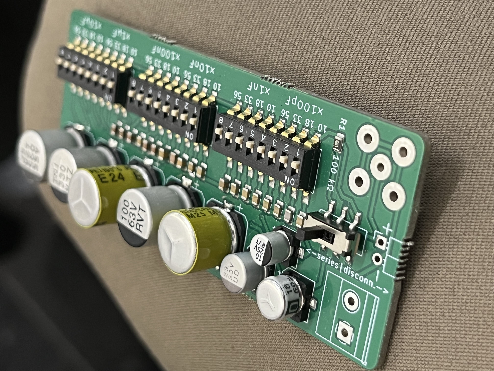
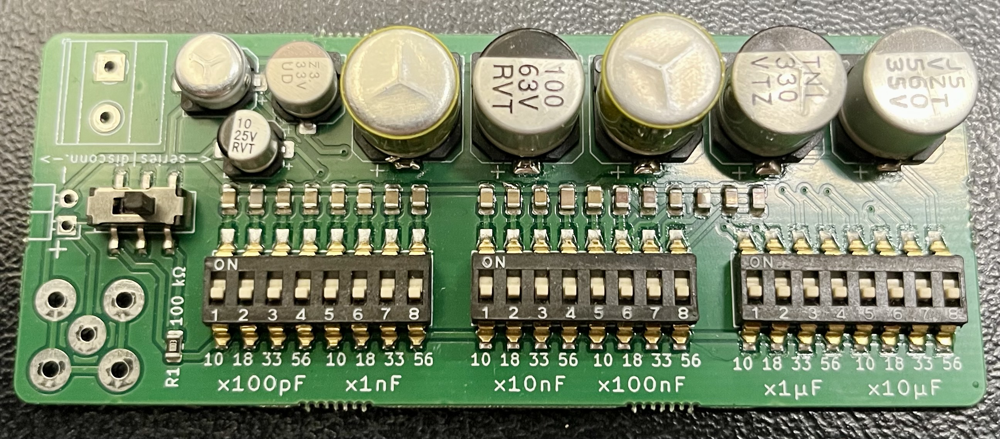
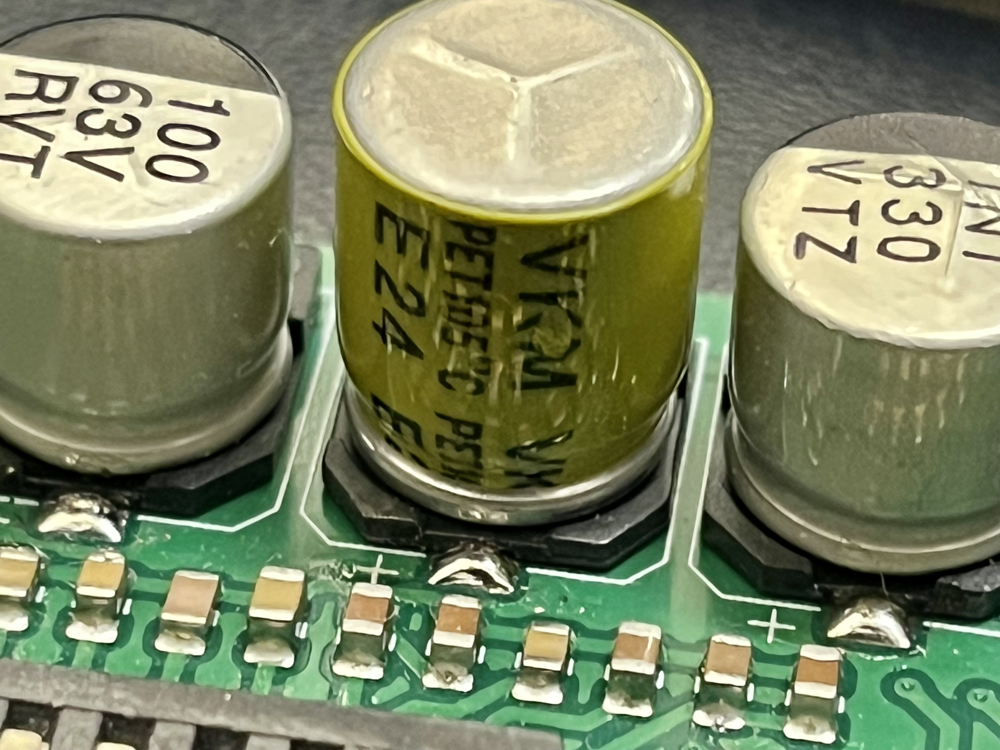
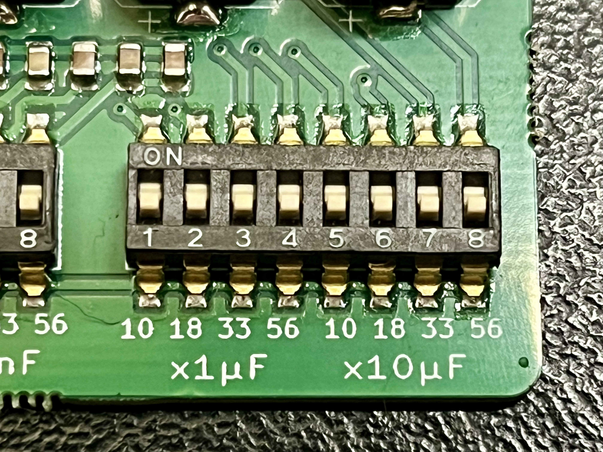
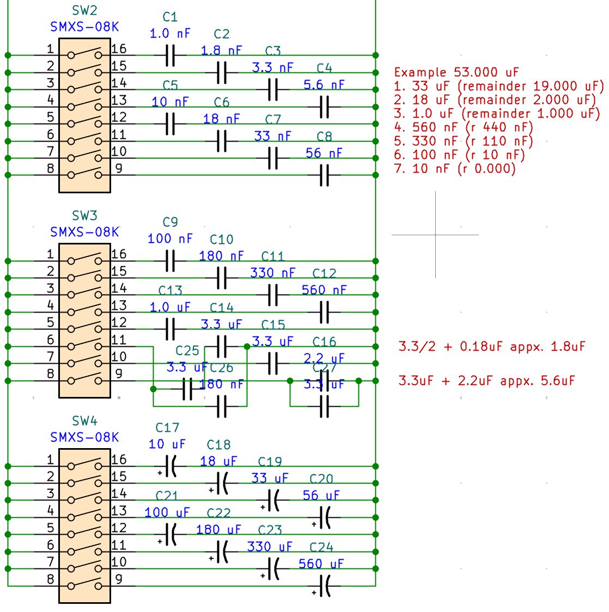
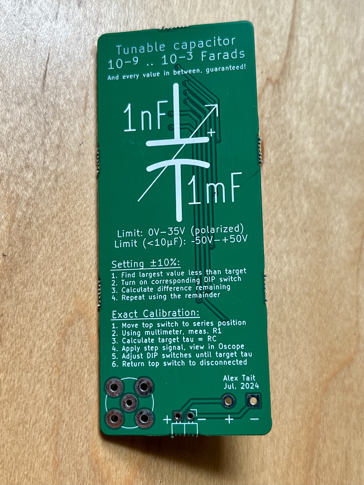

# DIPcap

A variable capacitor bank built from DIP switches. Six decades of coverage (1 nF to 1 mF) for under $10 to build.

[Explore the files on KiCanvas](https://kicanvas.org/?repo=https%3A%2F%2Fgithub.com%2Fatait%2FDIPcap%2Ftree%2Fmain%2Fsrc)

## What it is

DIPcap covers six decades with 24 switches arranged in three groups of eight, using a non-standard but deliberate value series that guarantees full range coverage with the optimal number of switches per decade.

The calibration guarantee is the interesting part: even with ±10% tolerance on individual capacitors, some combination of switches will converge on any target value.

## Specifications

| Parameter | Value |
|---|---|
| Range | 1 nF – 1,130 µF |
| Max voltage | 0-35V, or ±50V for values < 1 µF |
| Tolerance (dead reckoning) | ±10% |
| Parasitic capacitance (all off) | 28 pF (measured) |
| Output connector | BNC + screw terminal + pin header |
| Cost to build | ~$10/unit (panelized at 8) |

## Why these switch values?

The values per decade are **10, 18, 33, 56** (in units of the decade's base, e.g. ×100pF, ×1nF, etc.). This is not a standard E-series but is drawn from E12 so that common components are available.

Full coverage means every value between 10–100 (in normalized units) is reachable within ±10% by some switch combination, and the next lower decade handles the remaining gap.

The choice of four switches per decade follows from a coverage argument:

- 2³ = 8 steps per decade — not enough; the gap between steps (100÷8 = 12.5) exceeds the range of the next lower decade group (0–10)
- 2⁴ = 16 steps per decade — sufficient; four is the minimum power-of-2 count that guarantees full coverage

## Instructions

There are two ways to use DIPcap:
1. Dead reckoning — set by remainder approximation to within ±10%
2. Calibration — engage the series resistor, measure the RC time constant on a scope, and back out the exact capacitance regardless of component tolerance

The instructions are silkscreened on the back of the board.

## What's next

**DIPresi** — the same concept applied to resistance. Binary-weighted resistor bank with DIP switches, covering several decades of resistance.

## License

Hardware released under [CERN-OHL-S v2](LICENSE). Design files are the Complete Source as defined by the licence.

© 2026 Alex Tait — source location: https://github.com/atait/dipcap
